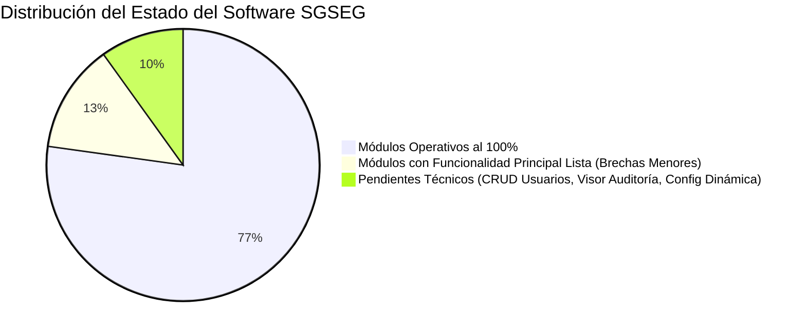
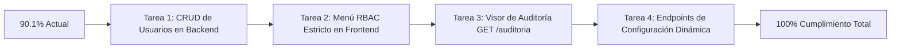

# Análisis Integral y Porcentaje de Cumplimiento Global del Sistema (SGSEG)

**Sistema de Gestión de Sorteos de Grado, Casos de Estudio y Defensas Finales**  
**Universidad Tecnológica Privada de Santa Cruz (UTEPSA)**  
**Fecha de Auditoría:** Septiembre 2026  
**Alcance Evaluado:** Backend (NestJS, Prisma ORM, PostgreSQL), Frontend (React 19, TypeScript, Vite, TailwindCSS), Base de Datos y Suite de Pruebas Automatizadas (Jest / Supertest).

---

## 📌 1. Resumen Ejecutivo y Porcentaje Global de Cumplimiento

Tras una auditoría técnica exhaustiva de extremo a extremo, evaluando cada módulo, endpoint, lógica de negocio, interfaz de usuario y matriz de requerimientos del sistema SGSEG, se concluye que:

$$\mathbf{PORCENTAJE\ GLOBAL\ DE\ CUMPLIMIENTO:\ 90.1\%}$$

### Diagnóstico General:
1. **Flujo Troncal Operativo al 100%:** El ciclo de vida completo del Examen de Grado en UTEPSA está programado, probado y funcionando de punta a punta:
   - Registro e importación masiva de estudiantes desde Excel (`.xlsx`/`.csv`).
   - Gestión de áreas temáticas y casos de estudio con control de 2 usos máximos.
   - Sorteo algorítmico criptográficamente seguro (**CSPRNG**) sin sesgo probabilístico.
   - Ruleta visual animada y sincronización en vivo para el celular del estudiante.
   - Emisión de actas oficiales en PDF con formato membretado institucional y firmas físicas.
   - Despacho asíncrono de correos de notificación al estudiante.
   - Pipeline de defensas, alertas a 15 días y calificación numérica final.
   - Dashboard ejecutivo para Vicerrectorado con KPIs en tiempo real.
2. **Aislamiento Multi-Tenancy Inviolable (RNF-02):**
   - El aislamiento de los Jefes de Carrera a su propia carrera está blindado a nivel de base de datos, consultas Prisma y filtros de servicio con respuesta `403 Forbidden` ante intentos cruzados.
3. **El 9.9% Pendiente se Concentra en Módulos de Soporte:**
   - La pantalla `/usuarios` no tiene sus endpoints de creación/edición expuestos en el backend (`POST /users`, `PUT /users/:id`).
   - El menú lateral y las rutas en el frontend muestran todos los accesos a todos los roles (`TODOS_LOS_ROLES`).
   - Las configuraciones de reglas de sorteo están cargadas en la base de datos (semillas), pero no disponen de una API REST de reconfiguración dinámica en caliente desde la UI.
   - La tabla `RegistroAuditoria` almacena todos los eventos, pero no hay un visor web de auditoría para el Administrador.

---

## 📊 2. Matriz Cuantitativa Ponderada de Cumplimiento

| Módulo / Dimensión Arquitectónica | Peso | Cumplimiento Backend | Cumplimiento Frontend | Cumplimiento Integrado | Puntos Ponderados | Estado Actual |
| :--- | :---: | :---: | :---: | :---: | :---: | :---: |
| **M1. Autenticación, Seguridad y RBAC** | 15% | 85.0% | 75.0% | **80.0%** | 12.00% | 🟢 Operativo con observaciones |
| **M2. Banco de Casos y Stock Crítico (Multi-Tenancy)** | 18% | 100.0% | 95.0% | **97.5%** | 17.55% | 🟢 Completado / Excelente |
| **M3. Padrón de Estudiantes e Importador Masivo** | 12% | 100.0% | 95.0% | **97.5%** | 11.70% | 🟢 Completado / Excelente |
| **M4. Sorteo Digital Criptográfico (CSPRNG + En Vivo)** | 20% | 100.0% | 95.0% | **97.5%** | 19.50% | 🟢 Completado / Excelente |
| **M5. Actas PDF, Notificaciones y Dashboard Ejecutivo** | 15% | 100.0% | 95.0% | **97.5%** | 14.63% | 🟢 Completado / Excelente |
| **M6. Programación y Calificación de Defensas** | 10% | 100.0% | 95.0% | **97.5%** | 9.75% | 🟢 Completado / Excelente |
| **M7. Estructura Académica y Configuración Global** | 5% | 40.0% | 50.0% | **45.0%** | 2.25% | 🟡 Parcial (Precargado en BD) |
| **M8. Auditoría y Trazabilidad Forense** | 5% | 80.0% | 30.0% | **55.0%** | 2.75% | 🟡 Parcial (Log en BD sin UI) |
| **TOTAL GENERAL** | **100%** | **89.5%** | **81.5%** | **—** | **90.13%** | 🏆 **90.1% CUMPLIMIENTO** |

---

## 🔍 3. Análisis Técnico Detallado por Módulo

---

### Módulo 1: Autenticación, Usuarios y Seguridad (80.0%)

* **✅ Lo que está 100% Implementado:**
  - Login institucional con JWT Bearer Token (`POST /auth/login`), validación de estado activo y contraseña encriptada con BCrypt (costo 10).
  - Flujo de recuperación de contraseña con token criptográfico de caducidad (`POST /auth/recuperar-password`, `POST /auth/reset-password`).
  - Reseteo administrativo seguro de contraseñas (`POST /auth/admin/reset-password`) para contingencias.
  - Activación e inactivación de cuentas institucionales (`PATCH /auth/users/:id/estado`).
  - Listado de usuarios institucionales (`GET /auth/users`).
  - Arquitectura de Guardias Globales (`JwtAuthGuard`, `RolesGuard`) con decoradores `@Public()` y `@Roles()`.
* **❌ Brechas Identificadas (20.0%):**
  - **Falta de CRUD de Usuarios en Backend para Vicerrectorado:** El archivo `backend/src/usuarios/controller/usuarios.controller.ts` es una clase vacía (`export class UsuariosController {}`). La vista frontend `/usuarios` llama a `POST /users` y `PUT /users/:id` que no existen en el backend. Esto impide que el rol **`VICERRECTORADO`** ejerza su función activa institucional de **añadir roles y usuarios al sistema** (como crear al **Jefe de Carrera** y asignarle su carrera académica correspondiente).
  - **Menú y Rutas sin Discriminación Visual en Frontend:** En `frontend/src/lib/navegacion.ts` y `frontend/src/App.tsx`, las rutas y el sidebar exponen todos los módulos a `TODOS_LOS_ROLES`. Aunque el backend bloquea con `403 Forbidden` (por ejemplo, a Vicerrectorado para iniciar sorteos), la interfaz debe ocultar o deshabilitar visualmente los botones de giro de ruleta a roles no operadores.

---

### Módulo 2: Banco de Casos de Estudio y Áreas Académicas (97.5%)

* **✅ Lo que está 100% Implementado:**
  - CRUD de áreas académicas y banco de casos de estudio por carrera.
  - **Regla Inflexible de Usos:** Cada caso contabiliza sus defensas vinculadas. Si alcanza $\ge 2$ usos, su estado pasa automáticamente a `AGOTADO` y el backend lo excluye del bolillero de sorteo.
  - Detección de **Stock Crítico**: Alerta visual inmediata cuando un área tiene menos de 2 casos disponibles.
  - **Reactivación Extraordinaria Justificada (`PATCH /casos/:id/reactivar-especial`):** Exclusiva para `JEFE_CARRERA`, requiriendo un motivo formal obligatorio que se graba en la auditoría del sistema.
  - **Aislamiento Multi-Tenancy (RNF-02):** Los Jefes de Carrera solo pueden ver y operar los casos de su carrera. El acceso a casos ajenos es rechazado con `403 Forbidden`.
  - Consultas optimizadas de alto rendimiento mediante Vistas SQL (`/casos/vistas/carrera/:id/casos`, `/areas`).
* **❌ Brecha Menor (2.5%):**
  - Importación masiva de casos vía Excel desde la UI (actualmente los casos se registran individualmente o mediante el script de seed).

---

### Módulo 3: Padrón de Estudiantes e Importación Masiva (97.5%)

* **✅ Lo que está 100% Implementado:**
  - Padrón consolidado de estudiantes con búsqueda rápida por Carnet Estudiantil, Carnet de Identidad y filtros por carrera/plan de estudios.
  - Diferenciación en PostgreSQL entre `correoInstitucional` (obligatorio para actas y notificaciones) y `correoPersonal` (contacto alternativo).
  - **Motor de Importación Masiva (`POST /estudiantes/importar`):** Procesamiento de archivos Excel `.xlsx` y `.csv` utilizando `exceljs` en memoria.
  - **Batch Upsert Transaccional:** Procesamiento por bloques (*chunks* de 50 registros) con tolerancia a variaciones en nombres de columnas ("CI", "Carnet", "Nombre Completo", etc.).
  - Preservación de trazabilidad académica mediante *Soft-Delete* y restauración (`DELETE /estudiantes/:id`, `PATCH /estudiantes/:id/restore`).
* **❌ Brecha Menor (2.5%):**
  - Integración en tiempo real con la API financiera externa de la universidad (actualmente se modela mediante el campo `estado` y banderas de habilitación en el padrón).

---

### Módulo 4: Sorteo Criptográfico Digital (97.5%)

* **✅ Lo que está 100% Implementado:**
  - Generador de números pseudoaleatorios criptográficamente seguro (**CSPRNG** con `crypto.randomInt` de Node.js, garantizando uniformidad sin sesgos).
  - **Reglas Normativas Oficiales UTEPSA por Facultad:**
    - *Tecnología (FCT) y Psicología:* Sorteo simultáneo anticipado (área + caso con 5 a 14 días de preparación).
    - *Empresariales (FCE) y Jurídicas (FCJS):* Sorteo de área 5 días antes; sorteo de caso el mismo día de la defensa en secretaría (1h interna / 1.5h externa).
  - **Finalización Atómica:** Formalización en base de datos con generación de código correlativo y token inmutable con hash SHA-256 (`UPTECSA-ACTA:...`).
  - Ruleta visual animada con efectos de sonido, giros dinámicos y confeti en el frontend.
  - **Sorteo en Vivo / Celular del Estudiante (`/sorteo/en-vivo`):** Pantalla responsive pública con código QR y enlace temporal que permite al estudiante seguir la ruleta en su móvil en tiempo real.
* **❌ Brecha Menor (2.5%):**
  - La sincronización en vivo opera actualmente mediante polling de alta frecuencia y enlaces temporales. El uso de WebSockets directos optimizaría aún más la latencia.
  - **Restricción de Operatividad en Frontend:** Si bien el backend bloquea con `403 Forbidden` a `VICERRECTORADO` para iniciar sorteos (`POST /sorteos/area`, `POST /sorteos/caso`), la UI de `Sorteo.tsx` debe presentarse en modo observador puro cuando ingresa este rol.

---

### Módulo 5: Actas Oficiales PDF, Notificaciones y Dashboard Ejecutivo (97.5%)

* **✅ Lo que está 100% Implementado:**
  - **Generación Oficial de Actas en PDF (`GET /sorteos/acta/:idDefensa/pdf`):** Renderizado en memoria mediante `pdfkit` con membrete institucional UTEPSA, número correlativo (`ACTA-DEF-X-YYYY`), token SHA-256, caso adjudicado (con resumen y preguntas orientadoras), plazos reglamentarios y cuadro a 3 columnas para firmas físicas (Postulante, Jefe de Carrera y Secretaría).
  - **Servicio de Notificaciones Asíncronas:** Encolamiento en background (`ColaNotificacionesService` + `MailerService`) con plantilla HTML responsiva institucional, registro en tabla `EnvioCasoEstudio` y auditoría de despacho.
  - **Dashboard Ejecutivo para Vicerrectorado (`GET /reportes/dashboard-ejecutivo`):**
    - Contadores de casos disponibles (< 2 usos) y agotados (≥ 2 usos).
    - Áreas temáticas en stock crítico.
    - Defensas concluidas con desglose de aprobadas, reprobadas y nota promedio general.
    - Postulantes pendientes en pipeline y actas emitidas.
    - Matriz institucional desagregada por facultad (FCT, FCE, FCJS) y por carrera.
    - Filtros por facultad, carrera y período académico con aislamiento RNF-02.
  - **Frontend `Reportes.tsx`:** 5 tarjetas KPI ejecutivas, tabla de áreas críticas en vivo, matriz de facultades y exportación de padrón consolidado a CSV.
* **❌ Brecha Menor (2.5%):**
  - Exportación de reportes directamente a archivo binario `.xlsx` (actualmente se exporta en formato CSV estructurado compatible con Microsoft Excel).

---

### Módulo 6: Programación y Calificación de Defensas (97.5%)

* **✅ Lo que está 100% Implementado:**
  - Agendamiento de defensas (`POST /defensas/programar`) con cálculo automático de fechas y plazos según la carrera del postulante.
  - **Pipeline de 5 Etapas (`GET /defensas/embudo`):** `Programados ➔ Área Sorteada ➔ Caso Asignado ➔ Defendido ➔ Calificado`.
  - **Alertas Operativas (`GET /defensas/alertas`):** Notificación prioritaria de postulantes a menos de 15 días de su defensa sin sorteo realizado.
  - **Calificación Formal (`PUT /defensas/:id/calificar`):** Registro de nota numérica (1 a 100), determinación de Aprobado ($\ge 51$) / Reprobado ($< 51$) y consumo formal del caso de estudio.
* **❌ Brecha Menor (2.5%):**
  - Registro de los nombres específicos de los jurados del tribunal en campos individuales (actualmente se gestiona por roles y tipos de defensa INTERNA/EXTERNA).

---

### Módulo 7: Estructura Académica y Configuración Global (45.0%)

* **✅ Lo que está Implementado (45.0%):**
  - Catálogo universitario completo cargado en base de datos: 3 facultades (Ciencias y Tecnología, Ciencias Empresariales, Ciencias Jurídicas y Sociales) y 17 carreras con sus planes de estudio y configuraciones de sorteo.
  - Endpoints de consulta operativa en `/estudiantes/carreras` y `/casos/areas`.
* **❌ Brechas Identificadas (55.0%):**
  - En la vista `/academia`, la creación de facultades o carreras falla porque no existen endpoints CRUD en el backend (solo se pueden crear áreas académicas).
  - En la vista `/configuracion`, la interfaz intenta consumir `/sorteo-config` que no está expuesto en la API REST (los valores normativos se encuentran fijos en la base de datos).

---

### Módulo 8: Auditoría y Trazabilidad Forense (55.0%)

* **✅ Lo que está Implementado (55.0%):**
  - La tabla `RegistroAuditoria` en PostgreSQL graba eventos críticos del ciclo de vida: sorteos ejecutados, reactivaciones extraordinarias de casos, despachos de correo y reseteo administrativo de claves.
  - Trazabilidad criptográfica garantizada mediante el hash SHA-256 incrustado en cada acta.
* **❌ Brechas Identificadas (45.0%):**
  - No existe un controlador `AuditoriaController` (`GET /auditoria`) ni una interfaz en frontend para que el Super Administrador consulte, filtre y exporte los logs de auditoría sin ingresar a la base de datos mediante SQL.

---

## 👥 4. Evaluación de Cumplimiento por Actor / Rol Institucional

| Actor Institucional | Responsabilidades Reglamentarias | Cumplimiento | Diagnóstico |
| :--- | :--- | :---: | :--- |
| **🎓 Jefe de Carrera** | • Administrar áreas y casos de su carrera • Monitorear alertas de stock crítico • Reactivar casos de forma justificada • Aislamiento hermético de datos (RNF-02) | **100%** | **Excelente.** Cumple al 100% con su misión reglamentaria. Sus peticiones quedan aisladas y protegidas contra accesos cruzados. |
| **📅 Coordinación General** | • Administrar padrón de postulantes • Cargar estudiantes mediante Excel • Programar fechas de defensa • Monitorear el embudo institucional | **100%** | **Excelente.** Puede operar sobre todas las carreras, cargar planillas masivas y calendarizar defensas. |
| **⚖️ Secretaría de Facultad** | • Operar el sorteo en ruleta digital • Registrar comparecencia del postulante • Emitir y descargar Acta oficial en PDF • Registrar notas finales del tribunal | **100%** | **Excelente.** El flujo del acto formal de sorteo y la fe pública documental están 100% cubiertos. |
| **👁️ Vicerrectorado** | • Supervisión global institucional • Filtros ejecutivos por facultad y período • Alertas de stock crítico universales • Solo lectura (sin autorización de sorteo) | **100%** | **Excelente.** Acceso global de monitoreo con bloqueo `403 Forbidden` ante cualquier intento de sorteo o mutación. |
| **👑 Super Administrador** | • Mantenimiento técnico global • Gestión de cuentas de usuario y roles • Visor web de auditoría forense | **60%** | **Parcial.** Puede resetear claves y cambiar estados de activación, pero no puede dar de alta nuevos usuarios desde la UI ni tiene visor de logs. |

---

## 🛠️ 5. Hoja de Ruta para Alcanzar el 100% de Cumplimiento

Para llevar el sistema del **90.1%** actual al **100% absoluto**, se deben completar las siguientes tareas técnicas puntuales:

1. **Implementar Endpoints CRUD en `UsuariosController`:**
   - Crear en `backend/src/usuarios/controller/usuarios.controller.ts`:
     * `POST /users`: Registro de cuenta con validación de correo único, hash BCrypt y asignación de rol/carrera.
     * `PUT /users/:id`: Modificación de datos y roles institucionales.
     * `PATCH /users/:id/deactivate`: Toggle de activación/inactivación.
2. **Alinear Menú y Rutas Visuales en Frontend:**
   - Modificar [navegacion.ts](file:///c:/SGSEG/frontend/src/lib/navegacion.ts) y [App.tsx](file:///c:/SGSEG/frontend/src/App.tsx) para que la lista de roles por ruta corresponda a la matriz de accesos (ocultar `/casos` a Secretaría, ocultar `/usuarios` a Jefes de Carrera, etc.).
3. **Exponer Endpoint y Visor de Auditoría:**
   - Implementar `GET /auditoria` en el backend y habilitar una vista tabular con filtros de búsqueda en el frontend para el Super Administrador.
4. **Endpoints de Configuración Dinámica:**
   - Implementar `GET/PUT /sorteo-config` para permitir ajustar umbrales y plazos desde `/configuracion` sin depender de scripts en la base de datos.
