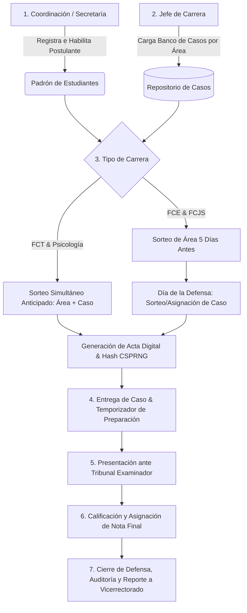

# SGSEG · Manual del Flujo Operativo y Arquitectura del Sistema
**Universidad Tecnológica Privada de Santa Cruz (UTEPSA)**  
*Sistema de Gestión de Sorteos de Grado, Casos de Estudio y Defensas Finales*

---

## 1. Visión General del Sistema

El **SGSEG** es una plataforma integral diseñada para automatizar, blindar y auditar todo el ciclo académico del Examen de Grado en la UTEPSA. El sistema garantiza transparencia e inviolabilidad en la asignación de temas mediante algoritmos criptográficos seguros (**CSPRNG**), previene la reutilización indebida de casos de estudio y proporciona trazabilidad total desde la postulación hasta la calificación final del tribunal.

> **Regla de Identidad:** El estudiante postulante **no interactúa directamente con el sistema ni posee credenciales**. Es gestionado como sujeto de evaluación por los estamentos académicos universitarios.

---

## 2. Matriz de Actores y Control de Acceso (RBAC)

El acceso a las vistas y endpoints está regulado por tokens JWT y roles estrictos:

| Rol | Alcance / Visibilidad | Principales Responsabilidades |
| :--- | :--- | :--- |
| **👑 Super Admin** | Global Universitario | Mantenimiento técnico, gestión de usuarios, parametrización de facultades/carreras y auditoría profunda. |
| **👁️ Vicerrectorado** | Global Universitario (**Solo Lectura**) | Supervisión institucional de calidad, monitoreo de cumplimiento de plazos reglamentarios, métricas y reportes ejecutivos. |
| **📅 Coordinación General** | Global Operativo | Administración del padrón de postulantes, habilitaciones académicas, programación de defensas y asignación de tribunales. |
| **🎓 Jefe de Carrera** | **Exclusivo de su Carrera** (Aislamiento Total) | Administración del banco de casos de estudio por área, control de stock, reactivación especial de casos y ejecución del sorteo digital. |
| **📝 Secretariado Académico** | Soporte por Facultad / Carrera | Habilitación documental, impresión y entrega de actas oficiales, control de temporizadores de resolución y registro de notas del jurado. |

---

## 3. Diagrama del Flujo Operativo de Extremo a Extremo

---

## 4. Descripción Detallada de las Etapas del Flujo

### Etapa 1: Padrón y Habilitación de Postulantes (`/estudiantes`)
1. **Registro:** Coordinación o Secretaría da de alta a los postulantes con sus datos oficiales (Nombre, Carnet de Identidad, Registro Universitario, Carrera, Plan de Estudios y Tipo de Examen: Interno o Externo).
2. **Validación:** Se verifica que el estudiante haya cumplido con el 100% de la malla curricular y no tenga observaciones financieras o documentales.
3. **Estado Inicial:** El postulante adquiere el estado `HABILITADO` para sorteo y se enlaza al calendario de exámenes.

---

### Etapa 2: Gestión y Stock de Casos de Estudio (`/casos`)
1. **Organización por Áreas:** Cada carrera cuenta con sus áreas de conocimiento aprobadas (ej. Derecho: *Penal, Civil, Laboral, Comercial, Constitucional*; Sistemas: *Ingeniería de Software, Redes, Base de Datos, Inteligencia Artificial*).
2. **Banco de Casos:** El Jefe de Carrera sube los casos con su título, descripción del problema, planteamiento detallado y preguntas de defensa.
3. **Regla de Oro de Usos (Máximo 2 defensas):**
   * Cada caso lleva un contador exacto de cuántas veces ha sido asignado y defendido.
   * **Caso Activo (< 2 usos):** Disponible para entrar a la ruleta/sorteo algorítmico.
   * **Caso Agotado (>= 2 usos):** El sistema lo bloquea automáticamente del bombo de sorteo para evitar que un caso sea recurrente entre estudiantes.
4. **Reactivación Especial y Justificada:**
   * Si una carrera agota los casos de un área crítica, **únicamente el Jefe de Carrera** puede solicitar una reactivación especial.
   * Requiere registrar una **justificación formal obligatoria**, la cual queda grabada con sello de tiempo e IP en la tabla de `RegistroAuditoria`.

---

### Etapa 3: Sorteo Digital Algorítmico y Ruleta (`/sorteos`)
El sorteo se ejecuta en presencia del postulante y las autoridades correspondientes. Utiliza un generador pseudoaleatorio de enteros criptográficamente seguro (`crypto.randomInt` de Node.js):

#### Reglas Diferenciadas por Unidad Académica:

| Facultad / Carrera | Momento Sorteo de Área | Momento Sorteo de Caso | Tiempo de Preparación del Postulante |
| :--- | :--- | :--- | :--- |
| **FCT** (Sistemas, Redes, Electrónica) | 5 a 14 días hábiles antes | Simultáneo con el Área | **7 días calendario** |
| **FCT** (Industrial y Comercial) | 5 a 14 días hábiles antes | Simultáneo con el Área | **5 días calendario** |
| **FCT** (Mecánica) | 14 días hábiles antes | Simultáneo con el Área | **14 días calendario** |
| **FCJS** (Psicología) | 10 días hábiles antes | Simultáneo con el Área | **10 días calendario** |
| **FCJS** (Derecho, Relaciones Int., Com.) | **5 días hábiles antes** | **El mismo día de la defensa** (en Secretaría) | • **1 hora** (Defensa Interna) • **1.5 horas** (Defensa Externa) |
| **FCE** (Empresariales, Comercial, Financiera) | **5 días hábiles antes** | **El mismo día de la defensa** (en Secretaría) | • **1 hora** (Defensa Interna) • **1.5 horas** (Defensa Externa) |

#### Dinámica Visual de la Ruleta SVG en 2 Fases:
1. **Fase 1 (Sorteo de Área):** La ruleta gira entre las áreas de la carrera hasta detenerse en el área asignada por el backend.
2. **Transición Fluida:** La interfaz transiciona dinámicamente y carga los casos activos de dicha área.
3. **Fase 2 (Asignación de Caso):** Se sortea o asigna el caso definitivo según los plazos reglamentarios de la carrera.
4. **Firma Criptográfica:** El sistema genera un código de verificación inmutable (`ACTA-YYYY-XXXXX`) y un hash SHA-256 de seguridad.

---

### Etapa 4: Emisión de Documentación Oficial
Una vez confirmado el sorteo, Secretaría o Jefatura de Carrera descargan e imprimen:
1. **Acta Oficial de Sorteo:** Contiene número correlativo, fecha/hora, datos del postulante, área sorteada, fecha programada de defensa, tribunal y espacio para firmas (Jefe de Carrera, Secretario/Testigo, Postulante).
2. **Documento del Caso de Estudio:** Se entrega en sobre cerrado o copia formal con el enunciado y preguntas guía para la defensa.

---

### Etapa 5: Programación, Tribunal y Calificación de Defensas (`/defensas`)
1. **Agendamiento:** Se asigna fecha, hora, aula física o sala virtual, y tribunal examinador:
   * **Defensa Interna:** Dos docentes evaluadores internos de la universidad.
   * **Defensa Externa:** Dos evaluadores (un docente interno y un representante acreditado del Colegio de Profesionales correspondiente).
2. **Embudo de Estados de la Defensa:**
   $$\text{PROGRAMADA} \longrightarrow \text{EN\_CURSO} \longrightarrow \text{DEFENDIDA} \longrightarrow \text{CALIFICADA}$$
3. **Asignación de Nota:**
   * Secretaría o el Presidente del Tribunal introduce la nota numérica final (escala de 1 a 100).
   * **Aprobado:** Nota $\ge 51$.
   * **Reprobado:** Nota $< 51$.
   * Al registrar la calificación, el caso de estudio incrementa su contador de usos consolidados.

---

### Etapa 6: Monitoreo Institucional y Reportes (`/reportes`)
1. **KPIs en Tiempo Real:** Total de postulantes inscritos, casos activos por área, sorteos realizados en el período y porcentaje de aprobación.
2. **Vista de Vicerrectorado:** Supervisión de la totalidad de facultades con filtros por período académico y alertas tempranas sobre áreas con bajo stock de casos disponibles.
3. **Auditoría:** Registro de eventos críticos (creación de casos, ejecuciones de sorteos, reaperturas o modificaciones de calificaciones).

---

## 5. Cuentas Preconfiguradas para Pruebas y Auditoría

Para verificar cada perspectiva del flujo operativo, el sistema cuenta con accesos directos en el Login conectados con usuarios sembrados en la base de datos:

| Perfil Institucional | Correo Electrónico | Contraseña | Permisos Clave |
| :--- | :--- | :--- | :--- |
| **Coordinación General** | `coord@uni.edu.bo` | `Admin123!` | Padrón de estudiantes, calendario general y defensas. |
| **Jefe de Carrera (Derecho)** | `jefe.derecho@uni.edu.bo` | `Admin123!` | Casos y sorteos exclusivos de Derecho (FCJS). |
| **Jefe de Carrera (Sistemas)** | `jefe.sistemas@uni.edu.bo` | `Admin123!` | Casos y sorteos exclusivos de Sistemas (FCT). |
| **Secretaría Académica** | `secretaria@uni.edu.bo` | `Admin123!` | Impresión de actas, entregas y registro de notas. |
| **Vicerrectorado** | `vicerrector@uni.edu.bo` | `Admin123!` | Monitoreo global de solo lectura y reportes institucionales. |

---

## 6. Estado Técnico del Repositorio

* **Rama Principal:** `main` (sincronizada y actualizada con GitHub `origin/main`).
* **Backend:** Compilación limpia (`npm run build`), NestJS + Prisma 7 con adaptador de conexión PostgreSQL (`@prisma/adapter-pg`).
* **Frontend:** Compilación limpia (`npm run build`), React 18 + Vite + TailwindCSS con módulos integrados de recuperación de clave, acceso rápido y ruleta interactiva.
