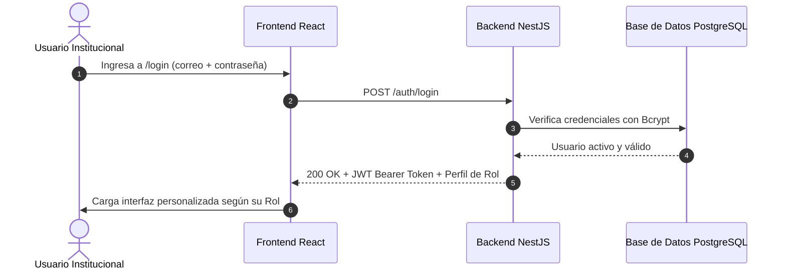
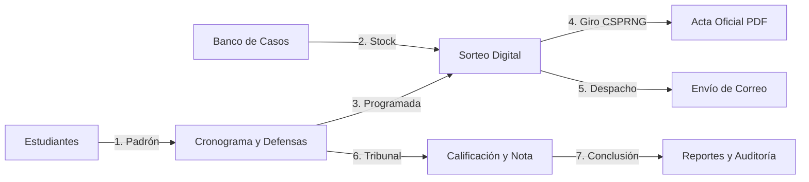
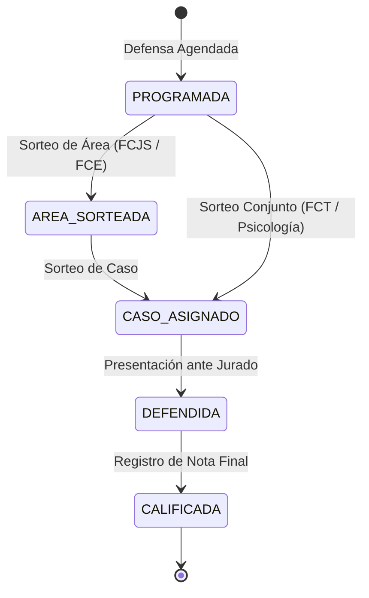

# Manual de Usuario Oficial — SGSEG
**Sistema de Gestión de Sorteos de Grado, Casos de Estudio y Defensas Finales**  
**Universidad Tecnológica Privada de Santa Cruz (UTEPSA)**  
*Versión 2.0 — Vigencia Académica 2026*

---

## 📌 Tabla de Contenidos

1. [Visión General del Sistema y Objetivos](#1-visión-general-del-sistema-y-objetivos)
2. [Matriz de Roles y Perfiles de Acceso (RBAC)](#2-matriz-de-roles-y-perfiles-de-acceso-rbac)
3. [Credenciales Oficiales de Prueba (Entorno de Desarrollo)](#3-credenciales-oficiales-de-prueba-entorno-de-desarrollo)
4. [Flujo de Acceso, Seguridad y Sesión](#4-flujo-de-acceso-seguridad-y-sesión)
5. [Guía Operativa por Módulo](#5-guía-operativa-por-módulo)
   - [5.1 Panel Principal y Métricas Rápidas (`/`)](#51-panel-principal-y-métricas-rápidas-)
   - [5.2 Padrón de Estudiantes e Importador Masivo (`/estudiantes`)](#52-padrón-de-estudiantes-e-importador-masivo-estudiantes)
   - [5.3 Banco de Casos de Estudio y Stock Crítico (`/casos`)](#53-banco-de-casos-de-estudio-y-stock-crítico-casos)
   - [5.4 Sorteo Digital Criptográfico y Ruleta en Vivo (`/sorteo`)](#54-sorteo-digital-criptográfico-y-ruleta-en-vivo-sorteo)
   - [5.5 Emisión de Actas Oficiales en PDF y Despacho de Correo](#55-emisión-de-actas-oficiales-en-pdf-y-despacho-de-correo)
   - [5.6 Cronograma, Agendamiento y Calificación de Defensas (`/defensas`)](#56-cronograma-agendamiento-y-calificación-de-defensas-defensas)
   - [5.7 Estructura Académica Universitaria (`/academia`)](#57-estructura-académica-universitaria-academia)
   - [5.8 Gestión de Usuarios y Roles Institucionales (`/usuarios`)](#58-gestión-de-usuarios-y-roles-institucionales-usuarios)
   - [5.9 Reportes Ejecutivos y Exportación CSV (`/reportes`)](#59-reportes-ejecutivos-y-exportación-csv-reportes)
   - [5.10 Auditoría Forense y Bitácora Transaccional (`/auditoria`)](#510-auditoría-forense-y-bitácora-transaccional-auditoria)
6. [Reglas de Negocio Institucionales Inviolables](#6-reglas-de-negocio-institucionales-inviolables)
7. [Preguntas Frecuentes (FAQ) y Soporte de Contingencia](#7-preguntas-frecuentes-faq-y-soporte-de-contingencia)

---

## 1. Visión General del Sistema y Objetivos

El **SGSEG** es la plataforma institucional desarrollada para automatizar, transparentar y auditar de forma integral la modalidad de graduación por **Examen de Grado** en la Universidad Tecnológica Privada de Santa Cruz (UTEPSA).

### Pilares Fundamentales:
* **Transparencia Criptográfica:** Reemplazo de bolos mecánicos por un generador de números aleatorios criptográficamente seguro (**CSPRNG** con `crypto.randomInt` de Node.js) sin sesgo estadístico.
* **Control de Stock Estricto (Regla de 2 Usos):** Los casos de estudio quedan automáticamente inhabilitados tras ser utilizados en 2 defensas para evitar recurrencia de preguntas.
* **Aislamiento Multi-Tenancy (RNF-02):** Cada Jefe de Carrera administra exclusivamente los casos, áreas y postulantes de su propia carrera, blindado en base de datos PostgreSQL y API.
* **Trazabilidad Forense Completa:** Cada acción crítica (sorteo, reactivación de caso, edición de notas o cambios de estado) genera un registro inmutable en auditoría con sello de tiempo UTC e IP.
* **Actas Blindadas:** Generación de actas en formato PDF oficial con correlativo único, hash SHA-256 y código QR para verificación inmediata.

> [!NOTE]
> **Identidad del Estudiante:** El postulante a grado **no ingresa directamente con cuenta al sistema**. Es registrado y gestionado por Coordinación, Secretaría y su Jefe de Carrera. Durante el sorteo, puede presenciar la ruleta en la pantalla del operador o seguirla en tiempo real en su dispositivo móvil escaneando el código QR de sincronización (`/sorteo/en-vivo`).

---

## 2. Matriz de Roles y Perfiles de Acceso (RBAC)

El acceso al SGSEG se rige por un esquema de control de acceso basado en roles con privilegios delimitados:

| Rol Oficial | Nombre en Pantalla | Alcance y Visibilidad | Funciones Principales |
| :--- | :--- | :--- | :--- |
| **`COORDINACION`** | Coordinador General | Global (Todas las Facultades) | Padrón de estudiantes, importación masiva Excel, agendamiento de fechas, asignación de tribunales, ejecución de sorteos y administración de cuentas. |
| **`JEFE_CARRERA`** | Jefe de Carrera | Exclusivo de su Carrera asignada | Administración de áreas y casos de estudio, monitoreo de stock crítico ($<2$ casos), reactivación especial de casos y sorteos de su carrera. |
| **`SECRETARIADO`** | Secretario de Facultad | Su Facultad / Global Operativo | Verificación de requisitos, operación de la ruleta digital, emisión e impresión de actas en PDF y registro de notas de defensa. |
| **`VICERRECTORADO`** | Vicerrectorado | Global Institucional (Supervisión) | Auditoría forense en vivo, dashboard de 5 KPIs ejecutivos, exportación consolidada de métricas. *(No inicia sorteos para preservar fe pública)*. |
| **`SUPER_ADMIN`** | Administrador General | Total Universitario (Infraestructura) | Mantenimiento técnico, reseteo de claves maestras, activación/desactivación de cuentas y auditoría de eventos. |
| **`REGISTRO`** | Registro Académico | Documental / Padrón | Validación de requisitos curriculares, verificación de egreso y visualización de notas. |
| **`DEFENSA`** | Defensas de Grado | Jurados / Tribunales | Seguimiento de conformación de tribunales y actas finales. |

---

## 3. Credenciales Oficiales de Prueba (Entorno de Desarrollo)

Todas las cuentas del catálogo de pruebas se inicializan con la contraseña estándar unificada: **`Admin123!`**.

| Rol | Usuario / Responsable | Correo Institucional (Login) | Contraseña | Alcance Asignado |
| :--- | :--- | :--- | :--- | :--- |
| **COORDINACION** | Coordinación Académica | `coord@uni.edu.bo` | `Admin123!` | Global Universitario |
| **SUPER_ADMIN** | Administrador Técnico SGSEG | `admin@uni.edu.bo` | `Admin123!` | Configuración e Infraestructura |
| **VICERRECTORADO** | Dra. Beatriz Gutiérrez | `vicerrector@uni.edu.bo` | `Admin123!` | Supervisión, Auditoría y Reportes |
| **SECRETARIADO** | Lic. Ana Flores Pérez | `secretaria@uni.edu.bo` | `Admin123!` | Operación Ruleta y Emisión Actas |
| **JEFE_CARRERA** | Ing. Carlos Mendoza | `jefe.sistemas@uni.edu.bo` | `Admin123!` | Ingeniería de Sistemas (FCT) |
| **JEFE_CARRERA** | Dr. Roberto Quinteros | `jefe.derecho@uni.edu.bo` | `Admin123!` | Derecho (FCJS) |
| **JEFE_CARRERA** | Lic. Mariana Gutiérrez | `jefe.psicologia@uni.edu.bo` | `Admin123!` | Psicología (FCJS - 10 días anticipado) |
| **JEFE_CARRERA** | Lic. Jimena Paz | `jefe.marketing@uni.edu.bo` | `Admin123!` | Marketing y Publicidad (FCE) |
| **JEFE_CARRERA** | Lic. Claudia Arteaga | `jefe.comercial@uni.edu.bo` | `Admin123!` | Ingeniería Comercial (FCE) |
| **JEFE_CARRERA** | Ing. Rolando Vaca Díez | `jefe.redes@uni.edu.bo` | `Admin123!` | Redes y Telecomunicaciones (FCT) |
| **REGISTRO** | Hernán Daza Cuéllar | `registro@uni.edu.bo` | `Admin123!` | Registro Académico |
| **DEFENSA** | Marcela Justiniano Dorado | `defensas@uni.edu.bo` | `Admin123!` | Defensas de Grado |

> [!TIP]
> Para regenerar la base de datos limpia con todas estas cuentas y catálogo completo, ejecute en la carpeta `backend/`:
> ```bash
> npm run db:seed
> ```

---

## 4. Flujo de Acceso, Seguridad y Sesión



### Pasos para Iniciar Sesión:
1. Abra el navegador e ingrese a la dirección del sistema (habitualmente `http://localhost:5173` en entorno de prueba o la URL oficial institucional).
2. Introduzca el **Correo Institucional** (ejemplo: `coord@uni.edu.bo`) y la **Contraseña**.
3. Presione **"Iniciar Sesión"**.
4. El sistema validará su perfil y adaptará la barra lateral de navegación con las opciones permitidas para su cargo.

### Cambio y Recuperación de Contraseña:
* **Cambio Voluntario:** En el menú superior de usuario, presione su perfil y elija **"Cambiar Contraseña"** ingresando su clave actual y la nueva contraseña.
* **Olvidé mi Contraseña:** En la pantalla de login, use el enlace **"¿Olvidó su contraseña?"** para recibir un token de restablecimiento en su correo institucional.
* **Reseteo Administrativo:** Coordinación o Super Admin pueden restablecer credenciales temporales desde la pantalla de [Usuarios y Roles](file:///c:/proyecto%20integrador/SGSEG/frontend/src/pages/Usuarios.tsx).

---

## 5. Guía Operativa por Módulo



---

### 5.1 Panel Principal y Métricas Rápidas (`/`)

El **Panel Principal** ofrece un panorama ejecutivo inmediato del estado académico del examen de grado:
* **KPIs Rápidos:** Total de postulantes en curso, defensas programadas para la semana, casos en inventario y áreas en stock crítico.
* **Alertas Operativas Prioritarias:** Resalta a aquellos postulantes con fecha de defensa a menos de 15 días que aún no cuentan con sorteo de área o caso ejecutado.
* **Filtros Dinámicos:** Permite alternar la información por Facultad, Carrera y Periodo Académico (ej. `II-2026`).

---

### 5.2 Padrón de Estudiantes e Importador Masivo (`/estudiantes`)

Módulo donde se gestiona el censo oficial de postulantes habilitados para rendir su examen.

```
+-----------------------------------------------------------------------------------+
|  Padrón de Estudiantes                                      [ + Nuevo Postulante ]|
|  Gestión de postulantes y carga masiva                      [ 📥 Cargar Planilla ] |
|                                                                                   |
|  Buscar: [🔍 8392011 SC         ]   Carrera: [ Todas       ▼]  Estado: [Todos ▼]  |
|                                                                                   |
|  CARNET EST.  NOMBRE COMPLETO           CARRERA   CORREO INSTITUCIONAL     ESTADO |
|  SIS-20220001 Morales Quispe Alejandro  Sistemas  alejandro.morales@est... ACTIVO |
|  DER-20220001 De La Barra Carlos        Derecho   carlos.delabarra@est...  ACTIVO |
+-----------------------------------------------------------------------------------+
```

#### A. Registro Individual de un Postulante:
1. Haga clic en **"+ Nuevo Postulante"**.
2. Ingrese los datos obligatorios:
   - **Carnet Estudiantil:** Código único (ej. `SIS-20220001`).
   - **Cédula de Identidad:** Con complemento de departamento (ej. `8392011 SC`).
   - **Nombres y Apellidos completos**.
   - **Correo Institucional:** *(Obligatorio)* Es la casilla formal donde se despacha el acta oficial.
   - **Correo Personal:** *(Opcional)* Canal alternativo de contacto.
   - **Carrera y Plan de Estudios:** Seleccione la carrera correspondiente.
3. Presione **"Guardar Postulante"**.

#### B. Importación Masiva mediante Planilla Excel/CSV:
1. Haga clic en **"Cargar Planilla"**.
2. Puede descargar la plantilla oficial predeterminada en formato `.xlsx` o `.csv`.
3. Seleccione el archivo desde su equipo y confirme la carga.
4. El sistema procesa los datos en transacciones seguras (lotes de 50 registros), normaliza columnas y genera un reporte en pantalla indicando:
   - Total de estudiantes importados con éxito.
   - Detalle de registros duplicados u observados con número de fila exacto.

---

### 5.3 Banco de Casos de Estudio y Stock Crítico (`/casos`)

Este módulo salvaguarda el repositorio académico de casos reales o simulados que serán asignados a los postulantes.

#### A. Aislamiento por Carrera (Multi-Tenancy):
* Si ingresa un **Jefe de Carrera** (ej. Sistemas), la pantalla sólo exhibirá las áreas y casos de **Ingeniería de Sistemas**. El acceso a otras carreras queda restringido.
* **Coordinación** y **Vicerrectorado** cuentan con selector global para inspeccionar cualquier carrera.

#### B. Regla Inquebrantable de Usos:
* Cada caso de estudio admite un **máximo de 2 usos** históricos.
* **Indicador de Estado:**
  - 🟢 **Disponible (0 o 1 uso):** Habilitado para ingresar a la ruleta.
  - 🔴 **Agotado (2 usos):** Excluido automáticamente de cualquier sorteo posterior.

#### C. Alerta de Stock Crítico:
Si un área académica tiene menos de 2 casos disponibles con menos de 2 usos, la interfaz despliega una insignia roja de **Stock Crítico** exigiendo al Jefe de Carrera la creación de nuevos casos.

#### D. Reactivación Especial Justificada:
En caso de fuerza mayor institucional donde un área se quede sin stock:
1. El **Jefe de Carrera** presiona **"Reactivación Especial"** sobre el caso agotado.
2. Es **obligatorio escribir una justificación formal** detallando el motivo académico.
3. El sistema reinicia el contador de usos y estampa la acción en el registro de auditoría forense con fecha, usuario y motivo.

---

### 5.4 Sorteo Digital Criptográfico y Ruleta en Vivo (`/sorteo`)

Es el corazón operativo del SGSEG. Garantiza un proceso transparente, aleatorio e inmutable.



#### Modalidades Reglamentarias según la Carrera:

| Facultad / Carrera | Modalidad de Sorteo | Regla de Plazos y Preparación |
| :--- | :--- | :--- |
| **Facultad de Ciencia y Tecnología (FCT)** | **Anticipado Conjunto** | Sorteo simultáneo de Área y Caso: Sistemas (7 días), Redes (7 días), Eléctrica (7 días), Electrónica (7 días), Mecánica (14 días), Industrial (5 días). |
| **Psicología (FCJS)** | **Anticipado Conjunto** | Sorteo simultáneo de Área y Caso **10 días calendario antes** de la defensa. |
| **Ciencias Jurídicas y Sociales (Derecho / RRII)** | **Separado en 2 Fases** | Sorteo de Área **5 días antes**. El día de la defensa se sortea el Caso (1 hora previa de preparación). |
| **Ciencias Empresariales (FCE)** | **Separado en 2 Fases** | Sorteo de Área **5 días antes**. El día de la defensa se sortea el Caso (1 hora previa de preparación). |

#### Procedimiento para Realizar el Sorteo:
1. Ingrese a **"Sorteo Digital"** (`/sorteo`).
2. Localice al estudiante postulante en la lista de defensas habilitadas.
3. Verifique la casilla **"Estudiante Presente"** (requerimiento reglamentario para dar fe pública).
4. **Sincronización en Vivo:** Comparta el código QR en pantalla con el estudiante para que abra `/sorteo/en-vivo` desde su teléfono móvil.
5. Presione **"Iniciar Sorteo"**:
   - La ruleta animada girará aplicando el algoritmo CSPRNG inyectado desde el backend.
   - El resultado se destacará con efectos sonoros y confeti institucional.
6. Presione **"Confirmar y Asignar Resultado"**:
   - Se persiste la transacción atómica en PostgreSQL.
   - Se incrementa el contador de uso del caso sorteado.
   - La defensa avanza automáticamente de etapa en el embudo.
   - Se genera el código de acta oficial (ej. `UPTECSA-ACTA-2026-00041`).

---

### 5.5 Emisión de Actas Oficiales en PDF y Despacho de Correo

Inmediatamente finalizado el sorteo:
1. **Descarga de Acta PDF:** Se habilita el botón **"Descargar Acta Oficial"**.
   - Generada mediante motor PDFKit en el servidor.
   - Contiene: Logotipo oficial UTEPSA, correlativo único, datos del postulante, fecha reglamentaria, área sorteada, título del caso asignado, hash SHA-256 de seguridad y cuadro con 3 columnas para firmas físicas del tribunal examinador.
2. **Despacho Automático de Correo:**
   - El sistema encola un correo asíncrono con el PDF adjunto y la redacción formal dirigida al correo institucional y personal del estudiante.

---

### 5.6 Cronograma, Agendamiento y Calificación de Defensas (`/defensas`)

Permite monitorear el calendario general de exámenes de grado y calificar el desempeño final:

1. **Agendamiento:** Coordinación registra la fecha y hora de la defensa, seleccionando si es modalidad **Interna** o **Externa**.
2. **Embudo de Estados:** Cada tarjeta de defensa se desplaza por las 5 columnas:
   - `PROGRAMADA`
   - `AREA_SORTEADA`
   - `CASO_ASIGNADO`
   - `DEFENDIDA`
   - `CALIFICADA`
3. **Registro de Calificación Final:**
   - Una vez concluida la exposición ante los jurados, presione **"Calificar Defensa"**.
   - Introduzca la nota final numérica en escala de **1 a 100**.
   - El sistema calcula automáticamente el dictamen:
     - **Nota $\ge$ 51:** `APROBADO` (Verde).
     - **Nota $<$ 51:** `REPROBADO` (Rojo).
   - Opcionalmente ingrese observaciones o dictamen del tribunal.

---

### 5.7 Estructura Académica Universitaria (`/academia`)

Visor y catálogo de parametrización institucional:
* Estructura arbórea: **Facultades $\to$ Carreras $\to$ Planes de Estudio $\to$ Áreas Académicas**.
* Permite verificar la vigencia de planes (ej. `Plan 2026`) y la cantidad de casos vinculados a cada área.

---

### 5.8 Gestión de Usuarios y Roles Institucionales (`/usuarios`)

Panel administrativo para la gobernanza de accesos al sistema. Habilitado para **Coordinación Académica** y **Administrador General**:

```
+-----------------------------------------------------------------------------------+
|  Usuarios y Roles                                             [ + Nuevo usuario ] |
|  Panel de control de cuentas institucionales y estados                            |
|                                                                                   |
|  NOMBRE COMPLETO     EMAIL                     ROL              CARRERA   ESTADO  |
|  Mariana Gutiérrez   jefe.psicologia@uni.edu.bo Jefe de Carrera  Psicología ACTIVO |
|  Jimena Paz          jefe.marketing@uni.edu.bo  Jefe de Carrera  Marketing  ACTIVO |
|  Carlos Mendoza      jefe.sistemas@uni.edu.bo   Jefe de Carrera  Sistemas   ACTIVO |
+-----------------------------------------------------------------------------------+
```

#### Para crear un nuevo usuario:
1. Presione **"+ Nuevo usuario"**.
2. Ingrese:
   - **Nombre Completo**.
   - **Correo Institucional** (ej. `jefe.carrera@uni.edu.bo`).
   - **Contraseña Inicial**.
   - **Rol:** (Jefe de Carrera, Secretario de Facultad, Coordinador General, Vicerrectorado, Registro, Defensas de Grado).
   - **Carrera Asignada:** *(Obligatorio si el rol seleccionado es Jefe de Carrera)*.
3. Presione **"Guardar Usuario"**.

#### Acciones de Mantenimiento:
* **Editar Usuario:** Modificar datos personales o carrera vinculada.
* **Activar / Inactivar Cuenta:** Mediante el interruptor lateral para suspender accesos sin destruir el historial en auditoría.

---

### 5.9 Reportes Ejecutivos y Exportación CSV (`/reportes`)

Herramienta analítica de control de gestión diseñada para **Vicerrectorado** y autoridades académicas:
* **Matriz Comparativa por Carrera:** Desglose de casos disponibles, casos agotados y total de defensas aprobadas/reprobadas.
* **Tasa de Aprobación Global:** Gráfica porcentual de rendimiento académico.
* **Exportación Consolidada en CSV:** Descarga con un solo clic de la sábana completa de datos compatible con Microsoft Excel para auditorías universitarias.

---

### 5.10 Auditoría Forense y Bitácora Transaccional (`/auditoria`)

Módulo de máxima seguridad disponible para **Vicerrectorado** y **Super Admin**:
* **Registro de Eventos en Tiempo Real:** Lista cronológica de todas las transacciones realizadas en la base de datos (inicios de sesión, sorteos ejecutados, actas emitidas, reactivaciones de casos y calificaciones).
* **Inspección de Carga Útil (Payload JSON):** Permite abrir el detalle de cualquier evento para inspeccionar los datos exactos antes y después de la operación.
* **Filtros Avanzados:** Búsqueda por rango de fechas, usuario ejecutor, tipo de evento o entidad afectada.

---

## 6. Reglas de Negocio Institucionales Inviolables

Para asegurar el rigor del proceso académico de graduación, el sistema aplica automáticamente las siguientes reglas inquebrantables:

1. **Regla de Usos Máximos (2 Usos por Caso):** Ningún caso de estudio puede ser sorteado más de dos veces. Tras el segundo sorteo, queda bloqueado irreversiblemente salvo reactivación especial justificada por el Jefe de Carrera.
2. **Aislamiento Multi-Tenancy:** Ningún Jefe de Carrera puede visualizar, editar ni reactivar casos o sorteos de otra carrera distinta a la que tiene asignada en su cuenta.
3. **Neutralidad de Vicerrectorado:** La cuenta de Vicerrectorado tiene restringido el inicio de sorteos. Su rol es exclusivamente de auditoría, supervisión y reporte.
4. **Fe Pública Presencial:** La plataforma no permite confirmar un sorteo si no se marca la constancia reglamentaria de que el estudiante se encuentra presente en sala.
5. **Cálculo Determinista de Plazos:** Los plazos de anticipación de sorteo (5, 7, 10 o 14 días) son computados en hora UTC por el servidor, previniendo alteraciones locales de zona horaria o reloj del cliente.
6. **Inmutabilidad del Acta:** Cada acta de sorteo se sella con un token SHA-256 criptográfico que vincula id de defensa, carnet del estudiante, caso otorgado y sello de tiempo.

---

## 7. Preguntas Frecuentes (FAQ) y Soporte de Contingencia

### ¿Qué debo hacer si un área académica se queda sin casos disponibles?
El Jefe de Carrera debe ingresar a `/casos` y dar de alta al menos 2 casos de estudio nuevos para el área afectada. En caso de emergencia, puede aplicar una **Reactivación Especial** sobre un caso existente redactando la justificación formal.

### ¿Qué ocurre si se corta la conexión a internet durante el giro de la ruleta?
El sorteo se procesa de forma transaccional en el servidor únicamente cuando se confirma el resultado. Si la ruleta visual fue interrumpida antes de presionar confirmar, la defensa permanece en estado `PROGRAMADA` y puede volverse a sortear sin inconsistencias en base de datos.

### ¿Un Jefe de Carrera puede crear nuevos usuarios?
No. La creación y asignación de roles de usuarios está reservada a **Coordinación Académica** y al **Administrador General**.

### ¿Cómo verifica un jurado examinador la autenticidad de un acta impresa?
El tribunal puede escanear el código QR impreso en el encabezado del documento o cotejar el código alfanumérico SHA-256 impreso al pie de página contra el registro del sistema en `/sorteos`.

---

*SGSEG — Desarrollado para la Dirección Académica y Decanaturas de la Universidad Tecnológica Privada de Santa Cruz (UTEPSA).*
